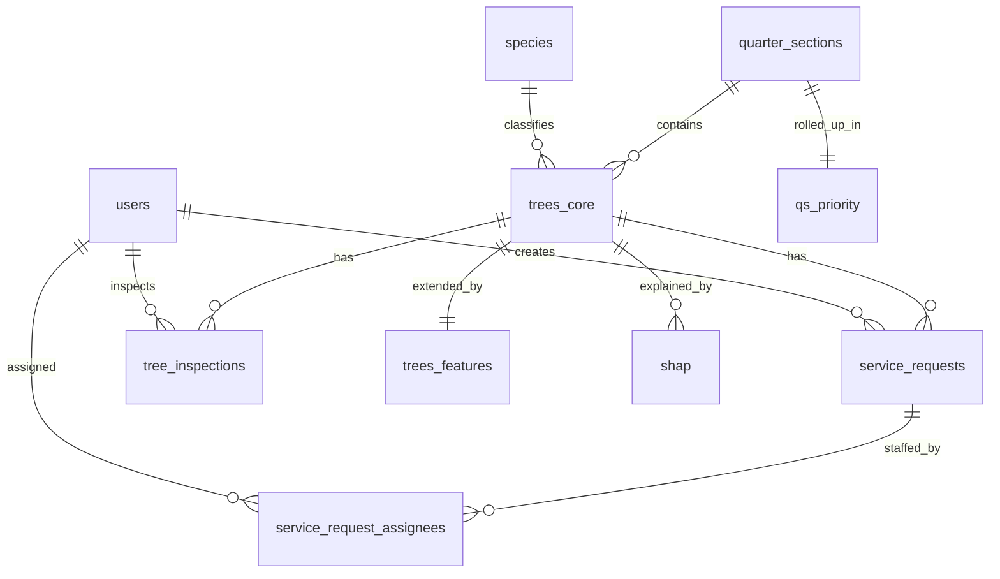

# Database Design

Refactor of the existing BigQuery dataset (`tree`, `quarter_section`, `shap`) into a CRUD-friendly operational layer with `species`, `users`, `service_requests`, and a many-to-many bridge — without dropping a single existing column and without breaking any existing code path.

This is the source of truth for the database refactor. The companion notebook [database/schema_migration.ipynb](database/schema_migration.ipynb) contains the DDL + backfill cells that materialize this design in BigQuery.

---

## 1. Overview

Two purposes share the same dataset:

- **Operational layer (writeable, CRUD)** — `users`, `species`, `quarter_sections`, `qs_priority`, `trees_core`, `trees_features`, `service_requests`, `service_request_assignees`, `tree_inspections`.
- **Analytics layer (read-only, kept as-is)** — `shap` (model explanations); the original `tree` and `quarter_section` tables stay during cutover, then are dropped once the new tables are validated.

Why two layers:

- The current `tree` table has ~95 columns mixing operational, addressing, derived, and ML feature data. That is fine for analytics but bad for CRUD forms.
- Splitting into `trees_core` (writeable) + `trees_features` (derived) lets the UI write narrow updates while ML / analytics still has everything it needs.
- Spatial + priority data on `quarter_section` is similarly split into `quarter_sections` (operational) + `qs_priority` (rollups).

Course rubric is satisfied by the operational layer alone (4+ tables with PK/FK, a many-to-many, constraints, 5 non-trivial queries).

---

## 2. ERD



The required many-to-many relationship is `service_requests` ↔ `users` via `service_request_assignees`.

---

## 3. Renaming policy

Only two renames, both at the API/JSON boundary so the frontend payload stays the same:

- `tree.tree_row_id` → `trees_core.tree_id`
- `quarter_section.QTRSEC` → `quarter_sections.qs_id`

All other columns keep their existing names. Species fields are normalized into a new `species` dimension and replaced on `trees_core` with `species_id` (after backfill).

---

## 4. Tables

### 4.1 `users` (new)

Holds Firebase identities + role for RBAC.

| Column      | Type      | Constraints                                 | Notes                       |
| ----------- | --------- | ------------------------------------------- | --------------------------- |
| user_id     | STRING    | PK NOT ENFORCED, NOT NULL                   | Firebase UID                |
| email       | STRING    | NOT NULL                                    |                             |
| role        | STRING    | NOT NULL, app-CHECK in `'admin','arborist','viewer'` | enforced in API |
| active      | BOOL      | NOT NULL, default TRUE                      |                             |
| created_at  | TIMESTAMP | NOT NULL, default CURRENT_TIMESTAMP         |                             |

### 4.2 `species` (new, normalized from `tree`)

| Column          | Type   | Constraints                          | Source column on `tree` |
| --------------- | ------ | ------------------------------------ | ----------------------- |
| species_id      | INT64  | PK NOT ENFORCED, NOT NULL            | generated               |
| species_code    | STRING | NOT NULL                             | species_code            |
| common_name     | STRING |                                      | species                 |
| scientific_name | STRING |                                      | scientific_name         |
| full_name       | STRING |                                      | full_name               |
| abbreviation    | STRING |                                      | abbreviation            |
| simple_species  | STRING |                                      | simple_species          |
| genus           | STRING |                                      | genus                   |

App-level uniqueness on `species_code` (BigQuery does not enforce unique).

### 4.3 `quarter_sections` (refactor of existing `quarter_section`, operational columns only)

PK = `qs_id` (mirrors `QTRSEC`). All non-priority columns from the current table land here unchanged.

| Column        | Type    | Constraints                | Source column on `quarter_section` |
| ------------- | ------- | -------------------------- | ---------------------------------- |
| qs_id         | STRING  | PK NOT ENFORCED, NOT NULL  | QTRSEC                             |
| OBJECTID      | INT64   |                            | OBJECTID                           |
| SECTION_      | STRING  |                            | SECTION_                           |
| TIER          | STRING  |                            | TIER                               |
| RANGE         | STRING  |                            | RANGE                              |
| QTR           | STRING  |                            | QTR                                |
| INDEX_ID      | STRING  |                            | INDEX_ID                           |
| TOWN          | STRING  |                            | TOWN                               |
| QTRSEC_NW     | STRING  |                            | QTRSEC_NW                          |
| QTRSEC_N      | STRING  |                            | QTRSEC_N                           |
| QTRSEC_NE     | STRING  |                            | QTRSEC_NE                          |
| QTRSEC_W      | STRING  |                            | QTRSEC_W                           |
| QTRSEC_E      | STRING  |                            | QTRSEC_E                           |
| QTRSEC_SW     | STRING  |                            | QTRSEC_SW                          |
| QTRSEC_S      | STRING  |                            | QTRSEC_S                           |
| QTRSEC_SE     | STRING  |                            | QTRSEC_SE                          |
| QTRSEC_NAM    | STRING  |                            | QTRSEC_NAM                         |
| SHAPE_LENG    | FLOAT64 |                            | SHAPE_LENG                         |
| district      | STRING  |                            | district                           |
| last_pruned   | INT64   |                            | last_pruned                        |
| pruning_cycle | STRING  |                            | pruning_cycle                      |
| next_prune    | FLOAT64 |                            | next_prune                         |
| geometry      | STRING  | GeoJSON text               | geometry                           |
| tree_count    | INT64   |                            | tree_count                         |
| created_at    | TIMESTAMP | NOT NULL                 | generated                          |

Clustering: `district`.

### 4.4 `qs_priority` (new — extracted rollups from `quarter_section`)

One row per quarter section. PK = FK to `quarter_sections`.

| Column                    | Type    | Source column on `quarter_section` |
| ------------------------- | ------- | ---------------------------------- |
| qs_id                     | STRING  | QTRSEC (PK + FK)                   |
| PS_critical               | FLOAT64 | PS_critical                        |
| PS_bottom90               | FLOAT64 | PS_bottom90                        |
| n                         | FLOAT64 | n                                  |
| PS_background             | FLOAT64 | PS_background                      |
| PS_composite              | FLOAT64 | PS_composite                       |
| Priority_Score_Normalized | FLOAT64 | Priority_Score_Normalized          |
| ps_global                 | FLOAT64 | ps_global                          |
| k                         | FLOAT64 | k                                  |
| critical_weight           | FLOAT64 | critical_weight                    |

### 4.5 `trees_core` (refactor of existing `tree`, operational columns only)

PK = `tree_id` (mirrors `tree_row_id`). FK to `quarter_sections.qs_id` and `species.species_id`. Holds every operational + addressing + dimension + condition + audit column from the current `tree` table.

Identity / linking:

| Column     | Type   | Constraints                       | Source column on `tree`                   |
| ---------- | ------ | --------------------------------- | ----------------------------------------- |
| tree_id    | STRING | PK NOT ENFORCED, NOT NULL         | tree_row_id                               |
| site_id    | STRING |                                   | site_id                                   |
| qs_id      | STRING | FK NOT ENFORCED -> quarter_sections | quarter_section                         |
| species_id | INT64  | FK NOT ENFORCED -> species        | resolved during backfill from species columns |
| status     | STRING | app-CHECK `'active','removed','planted','dead'` | derived from `missing_or_dead`/`reason_to_remove`; default `'active'` |
| created_at | TIMESTAMP | NOT NULL                       | generated                                 |
| updated_at | TIMESTAMP | NOT NULL                       | generated                                 |

Address / location:

| Column                     | Type    | Source column on `tree`         |
| -------------------------- | ------- | ------------------------------- |
| address                    | STRING  | address                         |
| full_address               | STRING  | full_address                    |
| street                     | STRING  | street                          |
| side                       | STRING  | side                            |
| site                       | STRING  | site                            |
| on_street                  | STRING  | on_street                       |
| closest_cross_street       | STRING  | closest_cross_street            |
| side_of_street             | STRING  | side_of_street                  |
| site_type                  | STRING  | site_type                       |
| direction_from_cross_street| FLOAT64 | direction_from_cross_street     |
| distance_from_cross_street | FLOAT64 | distance_from_cross_street      |
| latitude                   | FLOAT64 | latitude                        |
| longitude                  | FLOAT64 | longitude                       |
| district                   | STRING  | district                        |
| property_type              | STRING  | property_type                   |
| census_block_id            | STRING  | census_block_id                 |
| census_block_disadvantaged_area | BOOL | census_block_disadvantaged_area |

Aerial duplicates (kept verbatim, used by analytics):

| Column                  | Type    | Source column on `tree`   |
| ----------------------- | ------- | ------------------------- |
| address_aerial          | STRING  | address_aerial            |
| street_aerial           | STRING  | street_aerial             |
| side_aerial             | STRING  | side_aerial               |
| site_aerial             | FLOAT64 | site_aerial               |
| on_street_aerial        | STRING  | on_street_aerial          |
| species_aerial          | STRING  | species_aerial            |
| dbh_aerial              | FLOAT64 | dbh_aerial                |
| inventory_date_aerial   | STRING  | inventory_date_aerial     |
| condition_aerial        | STRING  | condition_aerial          |
| alder_aerial            | FLOAT64 | alder_aerial              |
| district_aerial         | STRING  | district_aerial           |
| property_type_aerial    | STRING  | property_type_aerial      |
| pruning_cycle_aerial    | FLOAT64 | pruning_cycle_aerial      |
| site_comments_aerial    | STRING  | site_comments_aerial      |
| _qs_str                 | FLOAT64 | _qs_str                   |

Dimensions / measurements:

| Column            | Type    | Source column on `tree` |
| ----------------- | ------- | ----------------------- |
| dbh               | INT64   | dbh                     |
| height            | FLOAT64 | height                  |
| crown_width       | FLOAT64 | crown_width             |
| crown_diameter_m  | FLOAT64 | crown_diameter_m        |
| crown_width_m     | FLOAT64 | crown_width_m           |
| crown_height_m    | FLOAT64 | crown_height_m          |
| crown_area_sqm    | FLOAT64 | crown_area_sqm          |
| crown_asymmetry   | FLOAT64 | crown_asymmetry         |
| max_spread_ft     | FLOAT64 | max_spread_ft           |
| growing_space     | FLOAT64 | growing_space           |
| tree_weight_kg    | FLOAT64 | tree_weight_kg          |
| canopy_volume_index | INT64 | canopy_volume_index     |
| slenderness       | FLOAT64 | slenderness             |
| wood_density      | FLOAT64 | wood_density            |

Condition / health:

| Column            | Type    | Source column on `tree` |
| ----------------- | ------- | ----------------------- |
| condition         | FLOAT64 | condition               |
| alder             | INT64   | alder                   |
| damage            | STRING  | damage                  |
| disease           | BOOL    | disease                 |
| canker            | BOOL    | canker                  |
| missing_or_dead   | STRING  | missing_or_dead         |
| reason_to_remove  | STRING  | reason_to_remove        |
| valuation_total   | FLOAT64 | valuation_total         |
| can_strike_building | BOOL  | can_strike_building     |
| dist_closest_road_m     | FLOAT64 | dist_closest_road_m     |
| dist_closest_building_m | FLOAT64 | dist_closest_building_m |
| dist_closest_tree_m     | FLOAT64 | dist_closest_tree_m     |
| species_to_plant  | STRING  | species_to_plant        |

Inventory / pruning / growth:

| Column            | Type    | Source column on `tree` |
| ----------------- | ------- | ----------------------- |
| inventory_date    | STRING  | inventory_date          |
| pruning_cycle     | INT64   | pruning_cycle           |
| last_pruned       | FLOAT64 | last_pruned             |
| years_since_pruned| INT64   | years_since_pruned      |
| maintenance_deficit | INT64 | maintenance_deficit     |
| estimated_age     | FLOAT64 | estimated_age           |
| age               | FLOAT64 | age                     |
| age_method        | STRING  | age_method              |
| dbh_growth_yr     | FLOAT64 | dbh_growth_yr           |
| height_growth_yr  | FLOAT64 | height_growth_yr        |
| crown_growth_yr   | FLOAT64 | crown_growth_yr         |
| site_last_changed_on | FLOAT64 | site_last_changed_on |
| site_comments     | STRING  | site_comments           |

Clustering: `qs_id, status`. App-CHECK constraints: `dbh > 0`, `height >= 0`, `latitude` between -90 and 90, `longitude` between -180 and 180, `species_id IS NOT NULL` for trees with `status='active'`.

### 4.6 `trees_features` (new — extracted ML/derived columns from `tree`)

One row per `tree_id`. PK = FK to `trees_core`.

| Column                   | Type    | Source column on `tree`     |
| ------------------------ | ------- | --------------------------- |
| tree_id                  | STRING  | tree_row_id (PK + FK)       |
| s_f                      | FLOAT64 | s_f                         |
| I_f_raw                  | FLOAT64 | I_f_raw                     |
| I_f                      | FLOAT64 | I_f                         |
| p_f                      | FLOAT64 | p_f                         |
| pruning_benefit_b        | FLOAT64 | pruning_benefit_b           |
| a_p                      | FLOAT64 | a_p                         |
| k1                       | INT64   | k1                          |
| k3                       | INT64   | k3                          |
| risk_term_k1_I_f_p_f_b   | FLOAT64 | risk_term_k1_I_f_p_f_b      |
| age_term_k3_a_p          | FLOAT64 | age_term_k3_a_p             |
| priority_score           | FLOAT64 | priority_score              |

### 4.7 `service_requests` (new — operational entity for CRUD)

| Column             | Type      | Constraints                                                         |
| ------------------ | --------- | ------------------------------------------------------------------- |
| service_request_id | STRING    | PK NOT ENFORCED, NOT NULL                                           |
| tree_id            | STRING    | FK NOT ENFORCED -> trees_core, NOT NULL                             |
| request_type       | STRING    | NOT NULL, app-CHECK `'prune','remove','plant','inspect','treat'`    |
| priority           | STRING    | NOT NULL, app-CHECK `'low','med','high','critical'`                 |
| status             | STRING    | NOT NULL, app-CHECK `'open','in_progress','completed','cancelled'`  |
| requested_at       | TIMESTAMP | NOT NULL                                                            |
| due_at             | TIMESTAMP |                                                                     |
| completed_at       | TIMESTAMP | NULL unless status='completed'                                      |
| notes              | STRING    |                                                                     |
| created_by         | STRING    | FK NOT ENFORCED -> users, NOT NULL                                  |

Clustering: `tree_id, status`.

### 4.8 `service_request_assignees` (new — required many-to-many)

| Column             | Type      | Constraints                                          |
| ------------------ | --------- | ---------------------------------------------------- |
| service_request_id | STRING    | composite PK NOT ENFORCED, FK NOT ENFORCED -> service_requests |
| user_id            | STRING    | composite PK NOT ENFORCED, FK NOT ENFORCED -> users  |
| assigned_at        | TIMESTAMP | NOT NULL                                             |
| assigned_by        | STRING    | FK NOT ENFORCED -> users                             |

### 4.9 `tree_inspections` (new — supports inspection workflow)

| Column           | Type      | Constraints                                |
| ---------------- | --------- | ------------------------------------------ |
| inspection_id    | STRING    | PK NOT ENFORCED, NOT NULL                  |
| tree_id          | STRING    | FK NOT ENFORCED -> trees_core, NOT NULL    |
| inspector_id     | STRING    | FK NOT ENFORCED -> users, NOT NULL         |
| condition_rating | FLOAT64   | app-CHECK between 0 and 5                  |
| disease_flag     | BOOL      |                                            |
| notes            | STRING    |                                            |
| inspected_at     | TIMESTAMP | NOT NULL                                   |

### 4.10 `shap` (existing — kept as-is)

All 125 columns preserved unchanged. `Site ID` continues to align with `trees_core.tree_id`.

---

## 5. Column-mapping summary (zero loss)

Every column in the three current schema files lands in exactly one target table:

- `tree.schema.json` (95 columns) → `trees_core` (operational + addressing + dimensions + condition + audit), `trees_features` (s_f, I_f_raw, I_f, p_f, pruning_benefit_b, a_p, k1, k3, risk_term_k1_I_f_p_f_b, age_term_k3_a_p, priority_score), `species` (species, scientific_name, full_name, abbreviation, species_code, simple_species, genus — replaced on `trees_core` by `species_id`).
- `quarter_section.schema.json` (33 columns) → `quarter_sections` (everything except priority rollups) + `qs_priority` (PS_critical, PS_bottom90, n, PS_background, PS_composite, Priority_Score_Normalized, ps_global, k, critical_weight).
- `shap.schema.json` (125 columns) → unchanged.

The migration notebook contains a row-count + column-count assertion cell that fails if any column is missed.

---

## 6. BigQuery DDL

BigQuery 2024+ supports `PRIMARY KEY (...) NOT ENFORCED` and `FOREIGN KEY (...) REFERENCES ... NOT ENFORCED` as informational metadata. CHECK constraints are not enforced by BigQuery; they are documented here and enforced in the API layer (cloud functions).

```sql
CREATE TABLE IF NOT EXISTS `mke-trees.mke_tree_dataset.users` (
  user_id    STRING   NOT NULL,
  email      STRING   NOT NULL,
  role       STRING   NOT NULL,
  active     BOOL     NOT NULL,
  created_at TIMESTAMP NOT NULL,
  PRIMARY KEY (user_id) NOT ENFORCED
);
```

```sql
CREATE TABLE IF NOT EXISTS `mke-trees.mke_tree_dataset.species` (
  species_id      INT64  NOT NULL,
  species_code    STRING NOT NULL,
  common_name     STRING,
  scientific_name STRING,
  full_name       STRING,
  abbreviation    STRING,
  simple_species  STRING,
  genus           STRING,
  PRIMARY KEY (species_id) NOT ENFORCED
);
```

```sql
CREATE TABLE IF NOT EXISTS `mke-trees.mke_tree_dataset.quarter_sections` (
  qs_id        STRING NOT NULL,
  OBJECTID     INT64,
  SECTION_     STRING,
  TIER         STRING,
  `RANGE`      STRING,
  QTR          STRING,
  INDEX_ID     STRING,
  TOWN         STRING,
  QTRSEC_NW    STRING,
  QTRSEC_N     STRING,
  QTRSEC_NE    STRING,
  QTRSEC_W     STRING,
  QTRSEC_E     STRING,
  QTRSEC_SW    STRING,
  QTRSEC_S     STRING,
  QTRSEC_SE    STRING,
  QTRSEC_NAM   STRING,
  SHAPE_LENG   FLOAT64,
  district     STRING,
  last_pruned  INT64,
  pruning_cycle STRING,
  next_prune   FLOAT64,
  geometry     STRING,
  tree_count   INT64,
  created_at   TIMESTAMP NOT NULL,
  PRIMARY KEY (qs_id) NOT ENFORCED
)
CLUSTER BY district;
```

```sql
CREATE TABLE IF NOT EXISTS `mke-trees.mke_tree_dataset.qs_priority` (
  qs_id                     STRING NOT NULL,
  PS_critical               FLOAT64,
  PS_bottom90               FLOAT64,
  n                         FLOAT64,
  PS_background             FLOAT64,
  PS_composite              FLOAT64,
  Priority_Score_Normalized FLOAT64,
  ps_global                 FLOAT64,
  k                         FLOAT64,
  critical_weight           FLOAT64,
  PRIMARY KEY (qs_id) NOT ENFORCED,
  FOREIGN KEY (qs_id) REFERENCES `mke-trees.mke_tree_dataset.quarter_sections`(qs_id) NOT ENFORCED
);
```

```sql
CREATE TABLE IF NOT EXISTS `mke-trees.mke_tree_dataset.trees_core` (
  tree_id    STRING NOT NULL,
  site_id    STRING,
  qs_id      STRING,
  species_id INT64,
  status     STRING NOT NULL,
  created_at TIMESTAMP NOT NULL,
  updated_at TIMESTAMP NOT NULL,

  address                          STRING,
  full_address                     STRING,
  street                           STRING,
  side                             STRING,
  site                             STRING,
  on_street                        STRING,
  closest_cross_street             STRING,
  side_of_street                   STRING,
  site_type                        STRING,
  direction_from_cross_street      FLOAT64,
  distance_from_cross_street       FLOAT64,
  latitude                         FLOAT64,
  longitude                        FLOAT64,
  district                         STRING,
  property_type                    STRING,
  census_block_id                  STRING,
  census_block_disadvantaged_area  BOOL,

  address_aerial                   STRING,
  street_aerial                    STRING,
  side_aerial                      STRING,
  site_aerial                      FLOAT64,
  on_street_aerial                 STRING,
  species_aerial                   STRING,
  dbh_aerial                       FLOAT64,
  inventory_date_aerial            STRING,
  condition_aerial                 STRING,
  alder_aerial                     FLOAT64,
  district_aerial                  STRING,
  property_type_aerial             STRING,
  pruning_cycle_aerial             FLOAT64,
  site_comments_aerial             STRING,
  _qs_str                          FLOAT64,

  dbh                              INT64,
  height                           FLOAT64,
  crown_width                      FLOAT64,
  crown_diameter_m                 FLOAT64,
  crown_width_m                    FLOAT64,
  crown_height_m                   FLOAT64,
  crown_area_sqm                   FLOAT64,
  crown_asymmetry                  FLOAT64,
  max_spread_ft                    FLOAT64,
  growing_space                    FLOAT64,
  tree_weight_kg                   FLOAT64,
  canopy_volume_index              INT64,
  slenderness                      FLOAT64,
  wood_density                     FLOAT64,

  condition                        FLOAT64,
  alder                            INT64,
  damage                           STRING,
  disease                          BOOL,
  canker                           BOOL,
  missing_or_dead                  STRING,
  reason_to_remove                 STRING,
  valuation_total                  FLOAT64,
  can_strike_building              BOOL,
  dist_closest_road_m              FLOAT64,
  dist_closest_building_m          FLOAT64,
  dist_closest_tree_m              FLOAT64,
  species_to_plant                 STRING,

  inventory_date                   STRING,
  pruning_cycle                    INT64,
  last_pruned                      FLOAT64,
  years_since_pruned               INT64,
  maintenance_deficit              INT64,
  estimated_age                    FLOAT64,
  age                              FLOAT64,
  age_method                       STRING,
  dbh_growth_yr                    FLOAT64,
  height_growth_yr                 FLOAT64,
  crown_growth_yr                  FLOAT64,
  site_last_changed_on             FLOAT64,
  site_comments                    STRING,

  PRIMARY KEY (tree_id) NOT ENFORCED,
  FOREIGN KEY (qs_id)      REFERENCES `mke-trees.mke_tree_dataset.quarter_sections`(qs_id) NOT ENFORCED,
  FOREIGN KEY (species_id) REFERENCES `mke-trees.mke_tree_dataset.species`(species_id) NOT ENFORCED
)
CLUSTER BY qs_id, status;
```

```sql
CREATE TABLE IF NOT EXISTS `mke-trees.mke_tree_dataset.trees_features` (
  tree_id                STRING NOT NULL,
  s_f                    FLOAT64,
  I_f_raw                FLOAT64,
  I_f                    FLOAT64,
  p_f                    FLOAT64,
  pruning_benefit_b      FLOAT64,
  a_p                    FLOAT64,
  k1                     INT64,
  k3                     INT64,
  risk_term_k1_I_f_p_f_b FLOAT64,
  age_term_k3_a_p        FLOAT64,
  priority_score         FLOAT64,
  PRIMARY KEY (tree_id) NOT ENFORCED,
  FOREIGN KEY (tree_id) REFERENCES `mke-trees.mke_tree_dataset.trees_core`(tree_id) NOT ENFORCED
);
```

```sql
CREATE TABLE IF NOT EXISTS `mke-trees.mke_tree_dataset.service_requests` (
  service_request_id STRING NOT NULL,
  tree_id            STRING NOT NULL,
  request_type       STRING NOT NULL,
  priority           STRING NOT NULL,
  status             STRING NOT NULL,
  requested_at       TIMESTAMP NOT NULL,
  due_at             TIMESTAMP,
  completed_at       TIMESTAMP,
  notes              STRING,
  created_by         STRING NOT NULL,
  PRIMARY KEY (service_request_id) NOT ENFORCED,
  FOREIGN KEY (tree_id)    REFERENCES `mke-trees.mke_tree_dataset.trees_core`(tree_id) NOT ENFORCED,
  FOREIGN KEY (created_by) REFERENCES `mke-trees.mke_tree_dataset.users`(user_id) NOT ENFORCED
)
CLUSTER BY tree_id, status;
```

```sql
CREATE TABLE IF NOT EXISTS `mke-trees.mke_tree_dataset.service_request_assignees` (
  service_request_id STRING NOT NULL,
  user_id            STRING NOT NULL,
  assigned_at        TIMESTAMP NOT NULL,
  assigned_by        STRING,
  PRIMARY KEY (service_request_id, user_id) NOT ENFORCED,
  FOREIGN KEY (service_request_id) REFERENCES `mke-trees.mke_tree_dataset.service_requests`(service_request_id) NOT ENFORCED,
  FOREIGN KEY (user_id)            REFERENCES `mke-trees.mke_tree_dataset.users`(user_id) NOT ENFORCED,
  FOREIGN KEY (assigned_by)        REFERENCES `mke-trees.mke_tree_dataset.users`(user_id) NOT ENFORCED
);
```

```sql
CREATE TABLE IF NOT EXISTS `mke-trees.mke_tree_dataset.tree_inspections` (
  inspection_id    STRING NOT NULL,
  tree_id          STRING NOT NULL,
  inspector_id     STRING NOT NULL,
  condition_rating FLOAT64,
  disease_flag     BOOL,
  notes            STRING,
  inspected_at     TIMESTAMP NOT NULL,
  PRIMARY KEY (inspection_id) NOT ENFORCED,
  FOREIGN KEY (tree_id)      REFERENCES `mke-trees.mke_tree_dataset.trees_core`(tree_id) NOT ENFORCED,
  FOREIGN KEY (inspector_id) REFERENCES `mke-trees.mke_tree_dataset.users`(user_id) NOT ENFORCED
);
```

---

## 7. Reference inventory (full refactor actions)

This is a true cutover. Frontend and backend both move to the new operational schema and endpoints.

Backend (required updates):

- [database/cloud_functions/main.py](database/cloud_functions/main.py)
  - Repoint SQL to `trees_core` + `trees_features` + `species` and `quarter_sections` + `qs_priority`.
  - Keep env keys, but update default/sample values to new table names.
  - Return canonical ids in JSON (`tree_id`, `qs_id`), with temporary aliases only if needed during rollout.
- [database/cloud_functions/analytics_query/main.py](database/cloud_functions/analytics_query/main.py)
  - Repoint `BQ_ANALYTICS_SOURCE_TABLE` to the refactored analytics source (built from new tables).
- [database/cloud_functions/analytics_query/compiler.py](database/cloud_functions/analytics_query/compiler.py)
  - Keep allowlist in sync with the new analytics source columns.
- [database/cloud_functions/analytics_schema/main.py](database/cloud_functions/analytics_schema/main.py)
  - Keep schema endpoint output in sync with compiler allowlist.
- [database/cloud_functions/get_quarter_section_map_data/main.py](database/cloud_functions/get_quarter_section_map_data/main.py)
  - Repoint data source to `quarter_sections` + `qs_priority`.
- [database/cloud_functions/get_qs_shap_details/main.py](database/cloud_functions/get_qs_shap_details/main.py)
  - Ensure SHAP lookup consistently keys by `tree_id`/site id mapping.
- [database/cloud_functions/list_quarter_sections/main.py](database/cloud_functions/list_quarter_sections/main.py)
  - No table change required (Firestore path).
- [database/cloud_functions/.env.example](database/cloud_functions/.env.example)
  - Update sample values to refactor-first table names.

Frontend (required updates):

- [frontend/src/pages/TreeRecordManagementPage.jsx](frontend/src/pages/TreeRecordManagementPage.jsx)
  - Implement full CRUD for `trees_core` and `service_requests`.
- [frontend/src/pages/MapDashboardPage.jsx](frontend/src/pages/MapDashboardPage.jsx)
  - Consume canonical id fields and new endpoint payloads.
- [frontend/src/hooks/useMapData.js](frontend/src/hooks/useMapData.js)
  - Migrate field mapping from legacy keys (`tree_row_id`, `quarter_section`) to (`tree_id`, `qs_id`).
- [frontend/src/hooks/useTreeShapExplanation.js](frontend/src/hooks/useTreeShapExplanation.js)
  - Send `tree_id` as the tree/site key.
- [frontend/src/analytics/useAnalyticsData.js](frontend/src/analytics/useAnalyticsData.js) and [frontend/src/analytics/remoteAnalytics.js](frontend/src/analytics/remoteAnalytics.js)
  - Verify analytics endpoint against the new source.
- [frontend/src/analytics/fieldCatalog.js](frontend/src/analytics/fieldCatalog.js)
  - Keep field ids aligned with backend compiler allowlist.
- [frontend/src/config/mapApiEnv.js](frontend/src/config/mapApiEnv.js)
  - Point URLs to refactored cloud function deployments.

Data loading notebooks:

- [database/bq-connection-writer.ipynb](database/bq-connection-writer.ipynb): raw ingest helper.
- [database/schema_migration.ipynb](database/schema_migration.ipynb): authoritative refactor/cutover notebook.

---

## 8. Migration notebook

[database/schema_migration.ipynb](database/schema_migration.ipynb) is the single executable that materializes this design. Cells in order:

1. **Setup** — load env (`BQ_PROJECT_ID`, `BQ_DATASET`, `BQ_LOCATION`), build BQ client.
2. **DDL** — `CREATE TABLE IF NOT EXISTS` for all 9 operational tables (the SQL in section 6).
3. **Backfill `species`** — distinct rows from `tree` (species, scientific_name, full_name, abbreviation, species_code, simple_species, genus); generate `species_id`.
4. **Backfill `quarter_sections` + `qs_priority`** — split current `quarter_section` columns by destination.
5. **Backfill `trees_core` + `trees_features`** — split current `tree` columns by destination, joining `species` to set `species_id`. Status defaults to `'active'` unless `missing_or_dead` is set or `reason_to_remove` is non-null.
6. **Empty-create operational entities** — `users`, `service_requests`, `service_request_assignees`, `tree_inspections` (no source data; rows added through the API).
7. **Cutover updates** — repoint cloud-function SQL/env to new tables (`trees_core`, `trees_features`, `species`, `quarter_sections`, `qs_priority`).
8. **Frontend/backend verification** — run map, analytics, and CRUD smoke tests on refactored endpoints.
9. **Assertions** — row-count parity (`COUNT(*)` on `tree` vs `trees_core`, etc.) and column-coverage check (every source column accounted for in a target table or explicitly waived).

The notebook is idempotent (uses `CREATE TABLE IF NOT EXISTS` + `MERGE` for backfills) so it can be re-run safely.

---

## 9. Business rules (server-enforced)

These live in the API/cloud-function layer because BigQuery does not enforce CHECK:

1. `dbh > 0` and `height >= 0` on insert/update of `trees_core`.
2. `latitude` ∈ [-90, 90], `longitude` ∈ [-180, 180].
3. Cannot create a `service_request` for a tree whose `status` is `'removed'` or `'dead'`.
4. `service_requests.completed_at` must be set when `status='completed'`, and must be NULL otherwise.
5. Only `users.role` ∈ `{'admin','arborist'}` can DELETE a tree or service request; viewers can only read.
6. At most one open `service_request` per `tree_id` per `request_type` (e.g., one open prune at a time).
7. `tree_inspections.condition_rating` ∈ [0, 5].
8. `species_id` must reference an existing `species` row when `trees_core.status='active'`.

---

## 10. Five non-trivial queries

Ready-to-paste BigQuery SQL. These satisfy the rubric's "5 non-trivial queries" requirement and are referenced in the final report.

### 10.1 CTE + window — top-risk trees per district

```sql
WITH ranked AS (
  SELECT
    tc.tree_id,
    tc.district,
    tf.priority_score,
    ROW_NUMBER() OVER (PARTITION BY tc.district ORDER BY tf.priority_score DESC) AS rank_in_district
  FROM `mke-trees.mke_tree_dataset.trees_core` tc
  JOIN `mke-trees.mke_tree_dataset.trees_features` tf USING (tree_id)
  WHERE tc.status = 'active'
)
SELECT * FROM ranked WHERE rank_in_district <= 10 ORDER BY district, rank_in_district;
```

### 10.2 EXISTS — quarter sections with at least one overdue open request

```sql
SELECT qs.qs_id, qs.district
FROM `mke-trees.mke_tree_dataset.quarter_sections` qs
WHERE EXISTS (
  SELECT 1
  FROM `mke-trees.mke_tree_dataset.service_requests` sr
  JOIN `mke-trees.mke_tree_dataset.trees_core` tc USING (tree_id)
  WHERE tc.qs_id = qs.qs_id
    AND sr.status IN ('open','in_progress')
    AND sr.due_at IS NOT NULL
    AND sr.due_at < CURRENT_TIMESTAMP()
);
```

### 10.3 Subquery — trees whose DBH exceeds their district average

```sql
SELECT tree_id, district, dbh
FROM `mke-trees.mke_tree_dataset.trees_core` tc
WHERE dbh > (
  SELECT AVG(dbh)
  FROM `mke-trees.mke_tree_dataset.trees_core`
  WHERE district = tc.district AND dbh IS NOT NULL
)
ORDER BY district, dbh DESC;
```

### 10.4 Join + group — request backlog by district x request type

```sql
SELECT
  tc.district,
  sr.request_type,
  COUNTIF(sr.status = 'open')         AS open_count,
  COUNTIF(sr.status = 'in_progress')  AS in_progress_count,
  COUNTIF(sr.status = 'completed')    AS completed_count
FROM `mke-trees.mke_tree_dataset.service_requests` sr
JOIN `mke-trees.mke_tree_dataset.trees_core` tc USING (tree_id)
GROUP BY tc.district, sr.request_type
ORDER BY tc.district, sr.request_type;
```

### 10.5 Time-window + set logic — completion rate this quarter

```sql
WITH this_quarter AS (
  SELECT DATE_TRUNC(CURRENT_DATE(), QUARTER) AS q_start,
         DATE_ADD(DATE_TRUNC(CURRENT_DATE(), QUARTER), INTERVAL 1 QUARTER) AS q_end
),
scheduled AS (
  SELECT service_request_id
  FROM `mke-trees.mke_tree_dataset.service_requests`, this_quarter
  WHERE due_at >= TIMESTAMP(q_start) AND due_at < TIMESTAMP(q_end)
),
completed AS (
  SELECT service_request_id
  FROM `mke-trees.mke_tree_dataset.service_requests`, this_quarter
  WHERE completed_at >= TIMESTAMP(q_start) AND completed_at < TIMESTAMP(q_end)
)
SELECT
  (SELECT COUNT(*) FROM scheduled) AS scheduled_count,
  (SELECT COUNT(*) FROM completed) AS completed_count,
  SAFE_DIVIDE((SELECT COUNT(*) FROM completed), (SELECT COUNT(*) FROM scheduled)) AS completion_rate;
```

---

## 11. Clustering / partitioning rationale

BigQuery does not use B-tree indexes; the equivalent is **clustering**.

- `trees_core` clustered by `qs_id, status` — most reads filter by quarter section + active/removed.
- `service_requests` clustered by `tree_id, status` — request lookups are tree-scoped and status-filtered.
- `quarter_sections` clustered by `district` — district filter on map dashboard.
- No partitioning needed at current data volume; revisit if `service_requests` or `tree_inspections` grow past 10M rows (then partition by `requested_at`/`inspected_at` monthly).

---

## 12. Security

- **AuthN**: every cloud function verifies a Firebase ID token (Bearer header) via `firebase_admin.auth.verify_id_token`, mirroring the pattern in [database/cloud_functions/analytics_query/firebase_auth.py](database/cloud_functions/analytics_query/firebase_auth.py).
- **AuthZ**: business-rule #5 above — role checked against `users.role` before any write/delete.
- **SQL safety**: all user-controlled identifiers go through allowlists, mirroring [database/cloud_functions/analytics_query/compiler.py](database/cloud_functions/analytics_query/compiler.py). User-supplied values use BigQuery `ScalarQueryParameter`, never string interpolation.
- **CORS**: limited to known frontend origins (see existing `_cors_headers` in [database/cloud_functions/main.py](database/cloud_functions/main.py)).
- **Secrets**: `serviceAccountKey.json` is gitignored; production uses Application Default Credentials.

---

## 13. Frontend implications (part of this refactor)

Frontend switches to the new system in the same refactor, centered on [frontend/src/pages/TreeRecordManagementPage.jsx](frontend/src/pages/TreeRecordManagementPage.jsx).

Required API endpoints for this refactor:

- `GET    /trees?qs_id=...&status=...` → `trees_core` + `species` join
- `GET    /trees/:tree_id`              → `trees_core` + `trees_features` + latest inspection
- `POST   /trees`                       → insert into `trees_core`
- `PATCH  /trees/:tree_id`              → update `trees_core` (subject to business rules 1–2, 5)
- `DELETE /trees/:tree_id`              → soft delete (set `status='removed'`)
- `GET    /service-requests?tree_id=...|status=...`
- `POST   /service-requests`            → subject to business rule 3
- `PATCH  /service-requests/:id`        → subject to business rules 4, 6
- `DELETE /service-requests/:id`
- `POST   /service-requests/:id/assignees` → many-to-many bridge
- `DELETE /service-requests/:id/assignees/:user_id`
