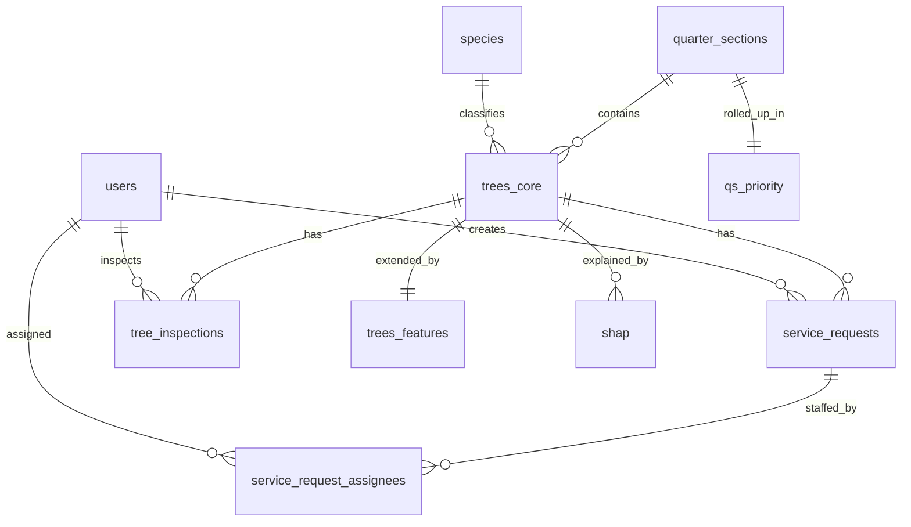

# Final Report: Milwaukee Trees — Database Design & Security

**Course submission draft** — Export this document to PDF and embed screenshots where indicated (`[Screenshot: …]`).

---

## Project Motivation

Urban tree inventories generate large, mixed-purpose datasets: operational fields (addressing, condition, maintenance), spatial boundaries (quarter sections), and ML-derived scores (SHAP-style explanations). A single wide table is convenient for analytics but awkward for safe CRUD and clear ownership of business rules.

This project refactors the BigQuery layer into an **operational schema** (`trees_core`, `trees_features`, `species`, `quarter_sections`, `qs_priority`, `users`, `service_requests`, `service_request_assignees`, optional `tree_inspections`) plus an unchanged **analytics** table (`shap`), so the web app can read and write a normalized model while preserving column-level traceability from the legacy `tree` / `quarter_section` sources. A **User Tasks** flow demonstrates end-to-end writes to `users`, `service_requests`, and the many-to-many bridge `service_request_assignees`.

**[Screenshot: Map or dashboard showing quarter sections / trees in the live app.]**

---

## Tech Stack + Justification

| Layer | Choice | Why it fits |
|--------|--------|-------------|
| Data warehouse | **Google BigQuery** | Managed scale, SQL interface, already hosting the inventory; supports clustering and declarative (non-enforced) PK/FK metadata. |
| Backend | **Firebase Cloud Functions (Python)** | HTTPS endpoints colocated with Firebase Auth; server-side BigQuery client with parameterized queries. |
| Auth | **Firebase Authentication** | ID tokens verified with `firebase_admin.auth.verify_id_token`; standard pattern for SPAs. |
| Frontend | **React + Vite** | Fast dev loop; env-based URLs to Cloud Function endpoints. |
| Migration / QA | **Jupyter notebooks** | Repeatable DDL, backfill, row-count checks, and `ASSERT`-based validation (`schema_migration.ipynb`, `bq_constraints_and_validation.ipynb`, `rename_tables_legacy.ipynb`). |

BigQuery does **not** enforce primary or foreign keys on insert/update (constraints are `NOT ENFORCED` by design). Integrity is addressed through **API validation**, **parameterized SQL**, and optional **BigQuery `ASSERT`** jobs as documented in the constraints notebook.

**[Screenshot: Repo or README snippet showing stack / deploy targets (optional).]**

---

## Database Design

### ERD (conceptual)

The production-oriented ERD (legacy source tables omitted) is:

**[Screenshot: Same ERD rendered from `DATABASE_DESIGN.md` in GitHub or exported diagram — PDF readers often render Mermaid poorly, so an image is best.]**

**Many-to-many:** `service_requests` ↔ `users` via `service_request_assignees` (composite primary key in DDL).

### Schema highlights

- **`species`**: Normalized dimension; `trees_core.species_id` replaces repeated species text columns from legacy `tree`.
- **`quarter_sections` + `qs_priority`**: Operational vs rollup columns split from legacy `quarter_section`.
- **`trees_core` + `trees_features`**: Operational / address / condition / audit columns vs ML-derived scores (one row per tree in each).
- **`users`**: `user_id` (Firebase UID), `email`, `role` (`admin` | `arborist` | `viewer`), `active`, `created_at`.
- **`service_requests`**: Work orders linked to `tree_id` and `created_by`; status and request_type enums documented in `DATABASE_DESIGN.md`.
- **`shap`**: Retained for analytics; keyed consistently with tree / site identifiers per project mapping.

Authoritative column lists and DDL fragments: [`DATABASE_DESIGN.md`](DATABASE_DESIGN.md) §4–6.

### Constraints (declarative + logical)

- **BigQuery DDL**: `PRIMARY KEY` / `FOREIGN KEY` **`NOT ENFORCED`** — documents the model and helps the optimizer; **does not reject** bad rows automatically.
- **CHECK-style rules** (dbh, lat/long, enum domains, inspection rating, etc.): specified in [`DATABASE_DESIGN.md`](DATABASE_DESIGN.md) §9; intended enforcement in the **API layer** (and optionally duplicated with **`ASSERT`** in [`database/bq_constraints_and_validation.ipynb`](database/bq_constraints_and_validation.ipynb)).
- **Uniqueness / orphan detection**: same notebook provides assertion patterns (e.g. duplicate PKs, FK orphans) suitable for manual runs or scheduled jobs.

**[Screenshot: BigQuery console — `INFORMATION_SCHEMA.TABLE_CONSTRAINTS` showing PK/FK rows, or a successful run of the assertions notebook.]**

### Indexes / physical design

BigQuery favors **table clustering** over traditional B-tree indexes:

| Table | Clustering | Rationale (from design doc §11) |
|--------|------------|----------------------------------|
| `quarter_sections` | `district` | Map/dashboard filters by district. |
| `trees_core` | `qs_id`, `status` | Quarter-section + active/removed filtering. |
| `service_requests` | `tree_id`, `status` | Tree-scoped request lists and status filters. |

Partitioning is deferred until row counts justify time-based partitions (e.g. monthly on `requested_at`).

### Five non-trivial queries

These are specified verbatim in [`DATABASE_DESIGN.md`](DATABASE_DESIGN.md) §10 (adjust project/dataset IDs for your environment):

1. **CTE + window** — Top 10 `priority_score` trees per `district` (join `trees_core` ↔ `trees_features`, `ROW_NUMBER` per district).
2. **EXISTS** — Quarter sections with at least one **overdue** open/in-progress `service_request` (`due_at < CURRENT_TIMESTAMP()`).
3. **Correlated subquery** — Trees whose `dbh` exceeds the **average `dbh` in the same district**.
4. **Join + aggregation** — Backlog counts by `district` × `request_type` (`COUNTIF` on status buckets).
5. **Time window + CTEs** — Scheduled vs completed requests in the **current calendar quarter** and a **completion rate** via `SAFE_DIVIDE`.

**[Screenshot: BigQuery UI showing one of the five queries and its result grid.]**

---

## Security Plan + Implementation

### Threat model (concise)

- Unauthorized access to HTTPS APIs and BigQuery-backed data.
- Token forgery or absence of authentication on sensitive endpoints.
- SQL injection via ad-hoc analytics or unsanitized parameters.
- Over-broad CORS allowing arbitrary origins to call APIs from browsers.
- Leakage of service account keys or environment secrets into version control.

### Controls implemented

1. **Authentication (AuthN)**  
   - Cloud Functions validate **`Authorization: Bearer <Firebase ID token>`** (e.g. `userTasksApi` in [`database/cloud_functions/main.py`](database/cloud_functions/main.py) via `_verify_firebase_user`; analytics endpoints use the shared `require_firebase_auth` pattern under `database/cloud_functions/*/firebase_auth.py`).

2. **Authorization (AuthZ)**  
   - **Design** (`DATABASE_DESIGN.md` §9): role-based rules (e.g. only `admin` / `arborist` for certain deletes) for the full tree/service-request API.  
   - **User Tasks API**: any **authenticated** user can invoke actions after token verification; **enum validation** constrains `role`, `request_type`, `priority`, and `status`. Tightening this to match §9 everywhere is a documented hardening step.

3. **SQL injection mitigation**  
   - User Tasks and similar paths use **BigQuery `ScalarQueryParameter` / `ArrayQueryParameter`** — values are not concatenated into SQL strings.  
   - Analytics compilation uses an **allowlisted** field catalog and compiler ([`database/cloud_functions/analytics_query/compiler.py`](database/cloud_functions/analytics_query/compiler.py)).

4. **CORS**  
   - Main map/API function uses an **allowlist** of origins (production Firebase Hosting URLs + local Vite ports) in `_cors_headers` ([`database/cloud_functions/main.py`](database/cloud_functions/main.py)). Some satellite functions use `*`; tightening to the same allowlist is optional consistency work.

5. **Secrets**  
   - `serviceAccountKey.json` and `.env` files are **gitignored**; production relies on **Application Default Credentials** / deployed service identities where possible.

**[Screenshot: Browser devtools — Network tab showing `Authorization: Bearer …` on an API request.]**  
**[Screenshot: Firebase console — Authentication users, or Cloud Function invocations (optional).]**

---

## Testing (sample user data + evidence)

Recommended evidence for the PDF:

1. **Migration / data integrity**  
   - Run [`database/schema_migration.ipynb`](database/schema_migration.ipynb) (or equivalent) and capture **row-count / column-coverage** assertion output.  
   - Optionally run [`database/bq_constraints_and_validation.ipynb`](database/bq_constraints_and_validation.ipynb) and show **green** (no failed `ASSERT`) runs.

2. **User Tasks (CRUD smoke)**  
   - Sign in with a **test Firebase user**.  
   - Create a **user** row (MERGE into `users`), create a **task** (`service_requests`), **assign** staff (`service_request_assignees`), **complete** and **delete** tasks.  
   - Capture UI screenshots and/or BigQuery **preview** of affected rows.

3. **Map / analytics**  
   - Load map data and (if used) analytics with the same authenticated session to show read paths still work against the refactored tables.

4. **Negative tests (optional but strong)**  
   - Call `userTasksApi` **without** a Bearer token → expect **401**.  
   - Submit invalid `request_type` → expect **400** with validation message.

**[Screenshot: User Tasks page after creating users and tasks.]**  
**[Screenshot: BigQuery table preview for `service_requests` / `service_request_assignees` matching the UI actions.]**

---

## Challenges Faced + Lessons Learned

- **BigQuery semantics**: Learning that PK/FK are **metadata-only** shifted validation design to **APIs + assertions** instead of expecting database-enforced referential integrity.  
- **Wide-table migration**: Splitting `tree` into `trees_core` / `trees_features` / `species` while preserving **column mapping traceability** required disciplined notebooks and documentation.  
- **Operational SQL**: Patterns like `ARRAY_AGG` with `GROUP BY` and correct `ORDER BY` aliases needed care to avoid runtime errors in task listing.  
- **UX + theming**: Global CSS variables and Tailwind layering interacted with headings; isolating styles (e.g. `#root.app-full-bleed`) avoided unreadable text on light surfaces.

---

## Feedback to the Instructor

**What worked well**  
- Treating **`DATABASE_DESIGN.md` as the single source of truth** alongside executable notebooks made the refactor gradable and repeatable.  
- Combining **Firebase Auth** with **parameterized BigQuery** is a realistic pattern for student full-stack + data-warehouse projects.

**What would help future cohorts**  
- An explicit rubric note that **BigQuery PK/FK are not enforced** would align expectations early and steer students toward **ASSERT**, **scheduled checks**, or **API validation** without penalty for “missing” engine enforcement.  
- A short primer on **clustering vs indexes** and **when to partition** would reduce confusion for teams coming from PostgreSQL.  
- Optional: a template **final report section** that distinguishes **target design (§9)** from **fully implemented enforcement on every endpoint**, so partial rollouts are easier to grade fairly.

---

## Appendix: Files to cite in the PDF

| Artifact | Path |
|----------|------|
| Full database spec | [`DATABASE_DESIGN.md`](DATABASE_DESIGN.md) |
| DDL + backfill | [`database/schema_migration.ipynb`](database/schema_migration.ipynb) |
| PK/FK metadata + ASSERT suite | [`database/bq_constraints_and_validation.ipynb`](database/bq_constraints_and_validation.ipynb) |
| Legacy renames | [`database/rename_tables_legacy.ipynb`](database/rename_tables_legacy.ipynb) |
| User Tasks + CORS + BQ DML | [`database/cloud_functions/main.py`](database/cloud_functions/main.py) |
